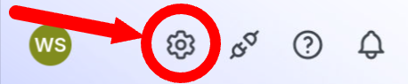

# Lab 1: Generate a LaunchDarkly API Token

Before the LaunchDarkly Copilot agent can interact with your feature flags, it needs a way to authenticate with the LaunchDarkly API. In this challenge, you'll create an API access token with the right permissions.

1. At the bottom of the left-hand navigation panel, click on the **Organization Settings**.

2. Scroll down the navigation panel and click **Authorization**.
3. Scroll down to **Access tokens** and click **Create token**.
4. In the **Name** field, enter:
```
copilot-cleanup-[[ Instruqt-Var key="projectkey" hostname="workstation" ]]
```
5. Assign the token the **Custom** base role, then select `instruqt-workshop - [[ Instruqt-Var key="projectkey" hostname="workstation" ]] Admin` under **Custom roles**.
6. Click **Save Token**
7. Copy the generated token and store it somewhere safe — you won't be able to view it again after closing the dialog.

⚠️ Treat this token like a password. You'll use it in the next challenge to configure the MCP server.

Once you have your token saved, click **Check** to continue.