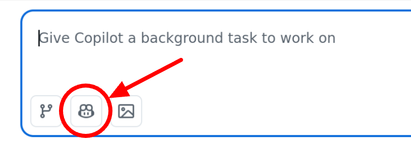

# Lab 4: Assess a Flag for Removal Using the Copilot UI

Now that everything is configured, you'll use the LaunchDarkly agent through the GitHub Copilot UI to evaluate whether a feature flag is safe to remove.

1. In the [GitHub](tab#1) Tab, return to the repository by clicking the user avatar in the upper right corner, then click **Repositories**.
2. Click **ld-sample-app-python**, then click the **Agents** tab.
3. Click the Agents icon:

4. Select `launchdarkly-flag-cleanup`.
4. Enter the following prompt:
```
Check if the flag  `coffee-promo-1` in the launchdarkly project `[[ Instruqt-Var key="projectKey" hostname="workstation" ]]` is safe to remove from this codebase.
```
Review the agent's response. It will query the LaunchDarkly API to check flag status across environments, look for any dependent flags, and analyze how the flag is used in the codebase.
Note the removal readiness assessment the agent provides — pay attention to whether it identifies a clear winning variant and whether any environments still have the flag actively targeted.

The agent won't make any changes yet — this challenge is about understanding what the agent checks before taking action.
Once you've reviewed the assessment output, click **Check** to continue.